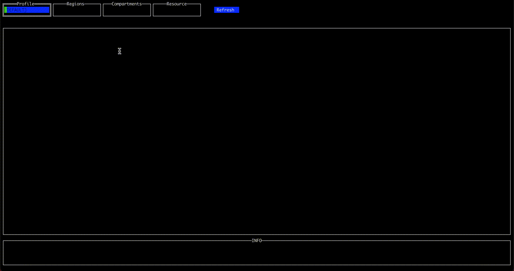
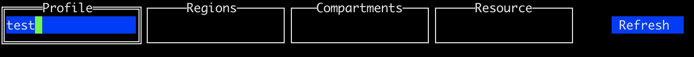
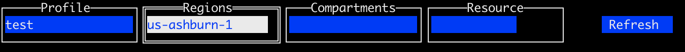
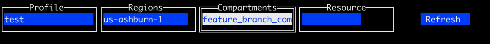
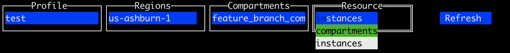
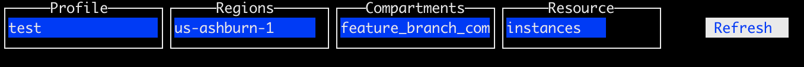
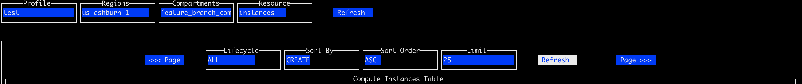

# Disclaimer

This project is NOT Oracle product. It's just application I've written in free time as functionality demonstrator. 

**All bugs are mine and mine alone.**

# TLDR;

In my free time I've written an application as demonstrator of using [golang](https://go.dev/) and [oci sdk](https://github.com/oracle/oci-go-sdk).
It's something between cloud console and cli. Hope you like it and find it useful. Please see [instruction](#instruction) for details.

# Table of contents
1. [Motivation](#motivation)
2. [Configuration](#configuration)
3. [Basic instruction](#instruction)
4. [Dependencies](#dependencies)
5. [Installation](#installation)

# Motivation <a name="motivation"></a>

[OCI](https://www.oracle.com/cloud/) provides awesome tools to manage resources. Both [OCI console](https://www.oracle.com) and [OCI CLI](https://github.com/oracle/oci-cli) are more than enough to manage resources in any way necessary.  But hammer is perfect tool when you have to hammer a nail, when you have to paint a wall it tends to be less useful. 
I found myself in specific use case condition. I have to switch between [tenancies](https://docs.oracle.com/en-us/iaas/Content/Identity/Tasks/managingtenancy.htm) very rapidly and I normally operate with name of resource as key value not [OCID](https://docs.oracle.com/en-us/iaas/Content/General/Concepts/identifiers.htm).  Very often action required is very simple, like START/STOP/RESTART compute instance and I found that most time in these cases is used for moving between tenancies and it's basically wasted. 

To switch between tenancies in OCI console you need to logout and login to new tenancy and if you are doing this often enough depending on browser you are using, you can run into a problem of cached sessions. 

With OCI CLI it's better as tenancy is part of [profile in configuration file header](https://docs.oracle.com/en-us/iaas/Content/API/SDKDocs/cliconfigure.htm), but you have to know OCID of resource that you want to manage. 

Therefore I needed a simple tool to allow me to:
- switch between tenancies as fast as possible using tenancy name;
- operate on resource name rather than OCID;
- execute basıc operations (for starters on compute instance).
	
In addition I wanted to work on some useful tool in [GOLANG](https://go.dev/). 

# Configuration <a name="configuration"></a>

Application is using subset of standard [OCI CLI configuration file](https://docs.oracle.com/en-us/iaas/Content/API/SDKDocs/cliconfigure.htm) located in by default in ```$HOME/.oci/config```.
Minimum required information is described below:

```properties
[tenancy_dev]
user=ocid1.user.oc1..aaaaaaaaaaaaaaaaaaaaaaaaaaaaaaaaaaaaaaaaaaaaaaaaaaaaaaaaaaa
fingerprint=aa:aa:aa:aa:aa:aa:aa:aa:aa:aa:aa:aa:aa:aa:aa:aa
key_file=/Users/jszczuko/.oci/oci_api_key.pem
tenancy=ocid1.tenancy.oc1..aaaaaaaaaaaaaaaaaaaaaaaaaaaaaaaaaaaaaaaaaaaaaaaaaaaaaaaaaaa
region=us-ashburn-1

[tenancy_qa]
user=ocid1.user.oc1..aaaaaaaaaaaaaaaaaaaaaaaaaaaaaaaaaaaaaaaaaaaaaaaaaaaaaaaaaaa
fingerprint=aa:aa:aa:aa:aa:aa:aa:aa:aa:aa:aa:aa:aa:aa:aa:aa
key_file=/Users/jszczuko/.oci/oci_api_key.pem
tenancy=ocid1.tenancy.oc1..aaaaaaaaaaaaaaaaaaaaaaaaaaaaaaaaaaaaaaaaaaaaaaaaaaaaaaaaaaa
region=us-ashburn-1
```

Headers of profiles ```[profile_name]``` will be used as key values for application.

# Basic Instruction <a name="instruction"></a>
Select profile using profile name defined in [configuration file](#configuration). After that press Enter. This will load list of regions and compartments that you have access to. 

Select region from drop list.

Select compartment by name from drop list.

Select resource type from drop list.

Press Enter on main Refresh button.

Press Enter on Refresh button of main resource table.


## Basic navigation

- Tab - next;
- Shift + Tab - previous;
- Enter - enter :) ;
- Esc - exit;
- Ctrl + C - exit application

# Dependencies <a name="dependencies"></a>
- [golang](https://go.dev/dl/) >= 1.18
- [oci sdk](https://github.com/oracle/oci-go-sdk) with all its dependencies;
- [tview](https://github.com/rivo/tview) with all its dependencies;
- [plot4tview](github.com/jszczuko/plot4tview).

List of all dependecies can be found in [go.mod](go.mod) file.

# Installation <a name="installation"></a>

## From sources

Clone repository
```bash
git clone https://github.com/jszczuko/ociterm.git
```
build binary
```bash
go build -o ociterm github.com/jszczuko/ociterm
```
Result will be binary build for your platform.

## From binary

Download newest version of [release](https://github.com/jszczuko/ociterm/releases).
Unzip it.
Use the version compiled for your architecture.

```bash
21000 -rwxr-xr-x   1 jszczuko  jszczuko    10M Jun  5 14:07 ociterm-darwin-amd64
20576 -rwxr-xr-x   1 jszczuko  jszczuko    10M Jun  5 14:07 ociterm-darwin-arm64
20360 -rwxr-xr-x   1 jszczuko  jszczuko   9.9M Jun  5 14:08 ociterm-linux-386
21312 -rwxr-xr-x   1 jszczuko  jszczuko    10M Jun  5 14:08 ociterm-linux-amd64
20712 -rwxr-xr-x   1 jszczuko  jszczuko    10M Jun  5 14:08 ociterm-windows-386.exe
21392 -rwxr-xr-x   1 jszczuko  jszczuko    10M Jun  5 14:09 ociterm-windows-amd64.exe
```
